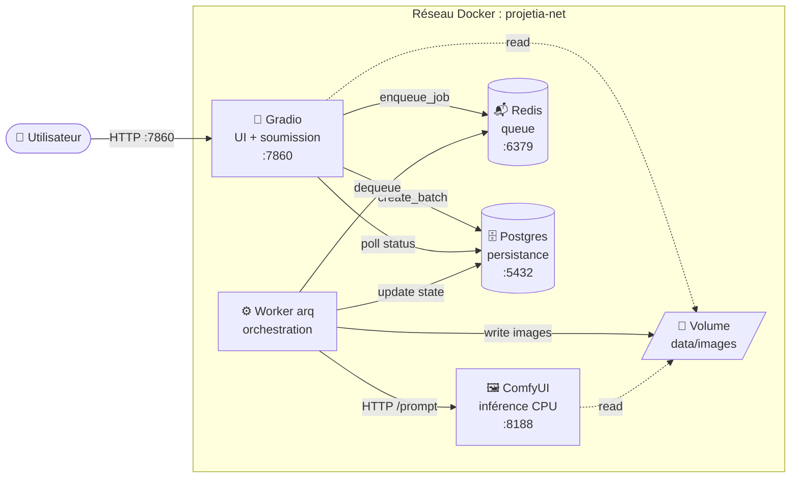
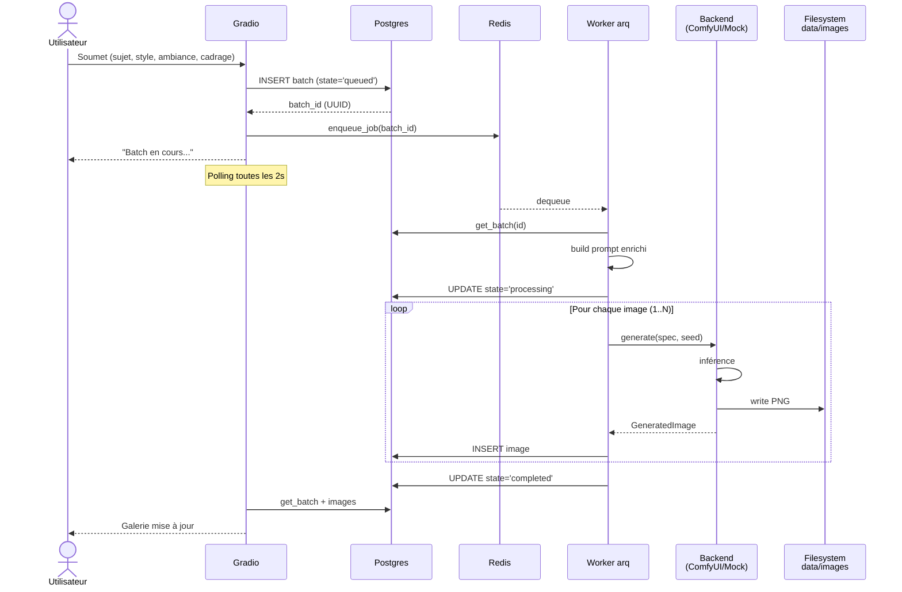
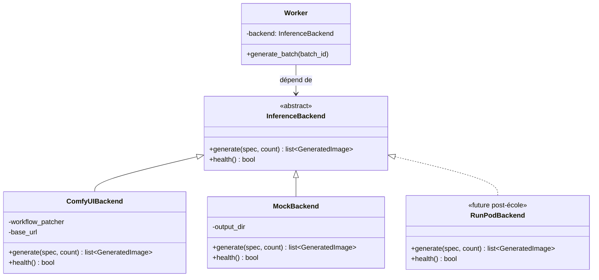

# ProjetIA-DevPro

> **Générateur d'images IA** auto-hébergé, accessible via une interface web minimaliste. L'utilisateur décrit ce qu'il veut voir en langage naturel et choisit un style, une ambiance et un cadrage. Le système s'occupe de tout le reste : enrichissement du prompt, génération via Stable Diffusion, persistance, affichage de la galerie.
>
> **Contexte** : MVP réalisé dans le cadre d'un projet école DevSecOps. Architecture pensée pour démontrer plusieurs paradigmes (event-driven async, inversion de dépendance, séparation stricte des responsabilités), sans GPU ni dépendance cloud externe.

---

## Sommaire

- [Architecture](#architecture)
- [Stack technique](#stack-technique)
- [Démarrage rapide](#démarrage-rapide)
- [Structure du projet](#structure-du-projet)
- [Configuration](#configuration)
- [Commandes utiles](#commandes-utiles)
- [Tests](#tests)
- [Justifications architecturales](#justifications-architecturales)

---

## Architecture

### Vue services

Cinq services Docker communiquent via une queue Redis et une base Postgres partagée. Le moteur d'inférence (ComfyUI) est isolé derrière une abstraction `InferenceBackend`, ce qui permet de le remplacer sans toucher au reste (ex : Futur utilisation de RunPod en production cloud).



### Flux d'un batch



### Pattern d'inversion de dépendance

Le worker dépend d'une **interface abstraite** `InferenceBackend`, pas d'une implémentation concrète. La factory choisit l'implémentation au démarrage selon la configuration.




---

## Stack technique

| Couche | Technologie | Pourquoi |
|---|---|---|
| **Langage** | Python 3.12 | Écosystème IA natif (ComfyUI, PyTorch). Asyncio mature pour orchestration I/O-bound. Pydantic pour les contrats typés. |
| **Gestion deps** | uv | 10-100× plus rapide que pip, lockfile reproductible |
| **UI** | Gradio 6.x | Composants riches (galerie, slider), backend Python, hot-reload natif |
| **Worker async** | arq | Workers Redis async (vs Celery sync). Intègre nativement asyncpg/httpx. |
| **Queue / cache** | Redis 7 | Backend arq, simple, faible empreinte mémoire |
| **DB** | Postgres 16 + asyncpg | Async natif, pas d'ORM (SQL centralisé dans `repository.py`) |
| **Inférence** | ComfyUI + DreamShaper 8 | ComfyUI est l'implémentation référence. DreamShaper 8 = SD 1.5 (~2 Go), CPU-friendly, public, ~3 min/image. |
| **Validation** | Pydantic 2 | Contrats d'interface entre tous les services |
| **Logs** | structlog | Logs structurés, lisibles en dev (`ConsoleRenderer`), JSON-ready en prod |
| **Conteneurisation** | Docker Compose | Démarrage en une commande, healthchecks, dépendances ordonnées |

---

## Démarrage rapide

### Prérequis

- Docker + Docker Compose
- ~5 Go d'espace disque libre (image ComfyUI + modèle DreamShaper)
- Connexion Internet pour le premier démarrage (téléchargement du modèle ~2 Go)

### Lancement

```bash
# 1. Cloner le repo
git clone <repo-url>
cd ProjetIA-DevPro

# 2. Copier la config par défaut
cp .env.example .env

# 3. Tout démarrer
make up
# Équivalent : docker compose up -d
```

> ⚠️ **Premier démarrage** : compter 10-15 min. Docker build l'image ComfyUI (clone du repo, install PyTorch CPU ~2 Go) puis télécharge DreamShaper 8 (~2 Go).
> Les démarrages suivants prennent quelques secondes.

### Accéder à l'UI

Ouvrir http://localhost:7860 (ou `http://<ip-vm>:7860` si la VM est distante).

Si tu travailles depuis un laptop avec la VM ailleurs, soit utiliser l'IP réseau de la VM, soit faire un tunnel SSH :

```bash
ssh -L 7860:localhost:7860 user@vm
```

---

## Structure du projet

```
ProjetIA-DevPro/
├── docker/                    # Dockerfiles par service
│   ├── gradio/Dockerfile
│   ├── worker/Dockerfile
│   └── comfyui/
│       ├── Dockerfile
│       └── entrypoint.sh      # Téléchargement modèle au 1er démarrage
│
├── src/                       # Code Python
│   ├── common/                # Partagé : config, models Pydantic, logging
│   ├── db/                    # Pool asyncpg + repository (CRUD batches/images)
│   ├── inference/             # Backends : base (interface) + comfyui + mock + factory
│   ├── prompt_builder/        # Mappings statiques + construction de prompt
│   ├── worker/                # Worker arq : jobs, settings, queue helper
│   └── gradio_app/            # UI : main, ui, handlers
│
├── workflows/                 # Workflows ComfyUI (JSON API format)
│   └── sd15_txt2img.json      # Workflow txt2img DreamShaper 8
│
├── scripts/                   # Scripts de test / utilitaires
│   ├── test_prompt_builder.py
│   ├── test_db.py
│   ├── test_mock.py
│   ├── test_comfyui.py
│   └── test_worker.py
│
├── data/                      # Volumes Docker (gitignored)
│   ├── images/                # Images générées (lecture/écriture worker, lecture gradio)
│   └── models/                # Modèle DreamShaper (téléchargé au 1er démarrage)
│
├── docker-compose.yaml        # Orchestration des 5 services
├── pyproject.toml             # Deps Python + config ruff/mypy/pytest
├── Makefile                   # Raccourcis dev (up, logs, tests, etc.)
├── scripts/init-db.sql        # Schéma Postgres (appliqué au 1er démarrage)
└── .env.example               # Variables d'environnement documentées
```

---

## Configuration

Toute la configuration passe par des **variables d'environnement** (cf `.env.example`). Le module `src/common/config.py` les charge dans un objet `Settings` Pydantic typé.

| Variable | Défaut | Description |
|---|---|---|
| `POSTGRES_USER` / `POSTGRES_PASSWORD` / `POSTGRES_DB` | `projetia` / `changeme` / `projetia` | Credentials Postgres |
| `POSTGRES_HOST` / `POSTGRES_PORT` | `postgres` / `5432` | Hostname dans le réseau Docker |
| `REDIS_HOST` / `REDIS_PORT` | `redis` / `6379` | |
| `COMFYUI_HOST` / `COMFYUI_PORT` | `comfyui` / `8188` | |
| `GRADIO_HOST` / `GRADIO_PORT` | `0.0.0.0` / `7860` | |
| `INFERENCE_BACKEND` | `comfyui` | `comfyui` (prod, ~3 min/image CPU) ou `mock` (dev rapide, ~50 ms/image) |
| `BATCH_SIZE` | `4` | Nombre d'images générées par batch (override l'utilisateur si > slider) |
| `LOG_LEVEL` | `INFO` | `DEBUG`, `INFO`, `WARNING`, `ERROR` |

### Switcher entre Mock et ComfyUI

Pour le dev rapide, on peut basculer en mock (génère des images placeholder en quelques ms) :

```bash
# Édite .env
INFERENCE_BACKEND=mock

# Recharge le worker
docker compose up -d worker
```

---

## Commandes utiles

Tout passe par le `Makefile`. Tape `make` ou `make help` pour la liste complète.

### Stack

```bash
make up              # Lance toute la stack
make up-light        # Lance sans ComfyUI (utile en dev avec INFERENCE_BACKEND=mock)
make down            # Stoppe (conserve les volumes)
make down-v          # Stoppe ET supprime les volumes (DB vidée !)
make ps              # État des containers
make restart         # Restart tous les services
make rebuild         # Rebuild from scratch (no cache)
```

### Logs

```bash
make logs            # Tous les logs
make logs-gradio     # Logs d'un service spécifique
make logs-worker
make logs-comfyui
make logs-db
```

### Debug interactif

```bash
make shell-gradio    # Bash dans le container Gradio
make shell-worker    # Bash dans le container Worker
make db-shell        # psql interactif
make redis-cli       # redis-cli interactif
```

### Tests bout-en-bout

```bash
make test-prompt-builder   # Affiche les prompts construits (pas besoin de DB/Redis)
make test-mock             # Teste MockBackend (génère 3 placeholders)
make test-db               # Teste le repository CRUD
make test-comfyui          # Teste ComfyUIBackend (génère 1 image, ~3 min CPU)
make test-worker           # Test bout-en-bout : Gradio simulé → Redis → worker → DB
```

### Reset

```bash
make reset-db        # Vide la DB + recharge le schéma
make clean-images    # Vide ./data/images/
```

---

## Tests

Les scripts dans `scripts/` permettent de **valider chaque brique en isolation** avant d'assembler. Particulièrement utiles pour debug.

| Test | Dépendances requises | Durée |
|---|---|---|
| `test_prompt_builder` | aucune | < 1 s |
| `test_db` | Postgres up | < 1 s |
| `test_mock` | aucune (écrit sur volume) | < 1 s |
| `test_comfyui` | ComfyUI up + modèle téléchargé | ~3 min CPU |
| `test_worker` | toute la stack up | ~5 s en mock, ~6 min en comfyui pour 2 images |

---

## Justifications architecturales

> Pour le détail des choix et alternatives rejetées, voir `Conception_MVP_Ecole.md`.

**Architecture event-driven asynchrone (queue-based)**
Les composants ne s'appellent pas directement. Gradio pousse un job dans Redis, le worker dépile à son rythme. Découplage temporel : si 50 utilisateurs soumettent en même temps, les jobs s'empilent sans saturer.

**Inversion de dépendance**
Le worker dépend d'une abstraction `InferenceBackend` (cf schéma plus haut). Trois implémentations possibles, choisies par configuration. Le code métier ne change jamais.

**Séparation stricte des responsabilités**
Cinq services, un seul rôle chacun. UI affiche, worker orchestre, ComfyUI infère, Postgres persiste, Redis transporte. Chacun peut évoluer ou être remplacé indépendamment.

**Workers stateless**
Aucun état local dans le worker. Toute la vérité vit en DB et Redis. On peut tuer/redémarrer un worker à tout moment sans perdre d'information. Permet aussi le scaling horizontal (plusieurs workers dépilent la même queue).

**Contrats typés Pydantic**
Tous les payloads (requêtes Gradio, jobs Redis, réponses ComfyUI) sont validés par Pydantic. Les frontières entre services sont explicites et vérifiables au runtime.

**Pas d'ORM, SQL centralisé**
asyncpg brut + module `repository.py` qui contient tout le SQL. Lisible, testable, refactorable. Pas de magie ORM cachée.

**Programmation fonctionnelle ciblée**
Le `prompt_builder.build()` est une fonction pure : pas d'I/O, déterministe à seed fixe, composition de mappings statiques. Trivialement testable, raisonnable d'un coup d'œil.

---

## Roadmap

- ✅ **Sprint 1** (22-24 avril) — Squelette Docker + tous les stubs Python
- ✅ **Sprint 2** (25 avril → 5 mai) — Vraie chaîne UI → queue → worker → inférence → galerie
- 🔄 **Sprint 3** (5 → 13 mai, avec Franck) — CI/CD GitLab, déploiement VM (Ansible) + K8s (ArgoCD)
- 🎓 **13 mai** — Soutenance

Pour le détail, voir `Conception_MVP_Ecole.md`.